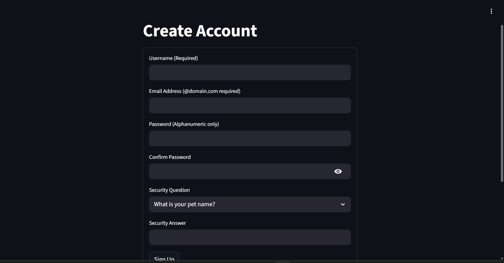
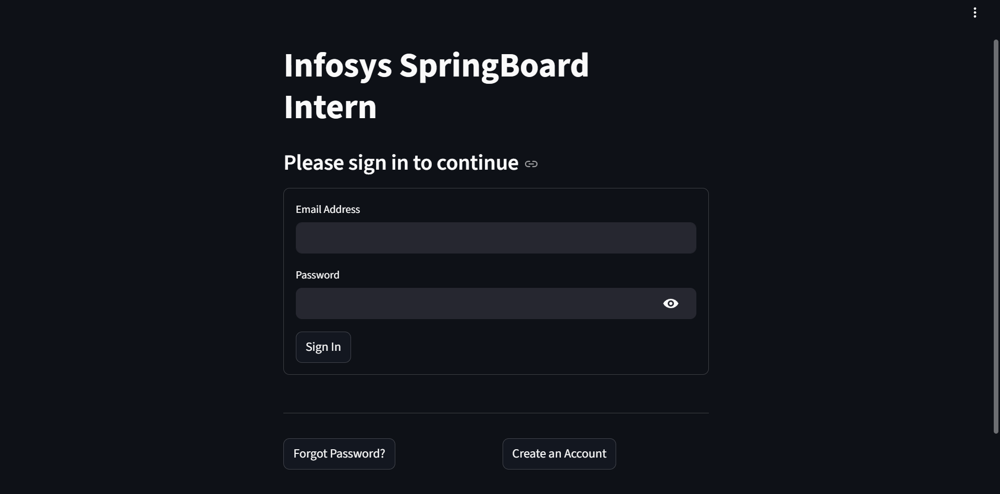
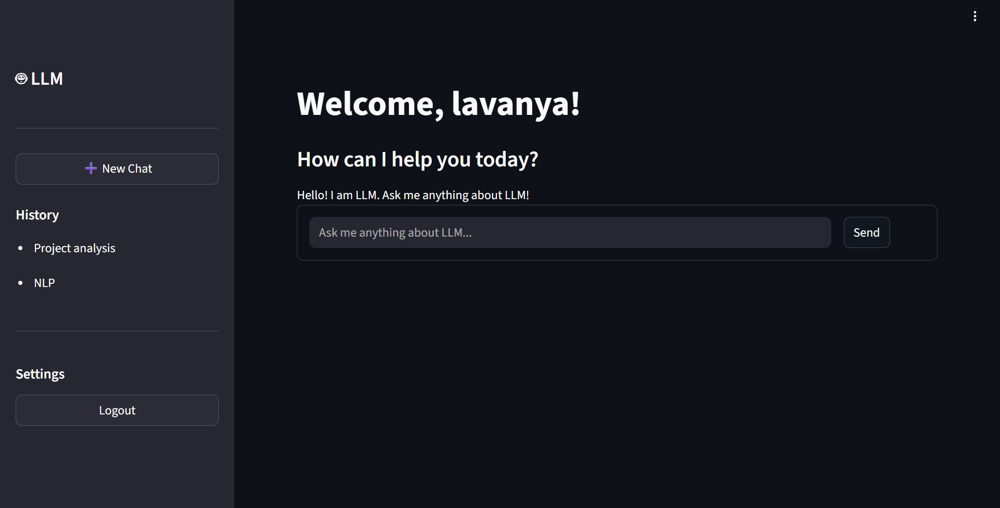
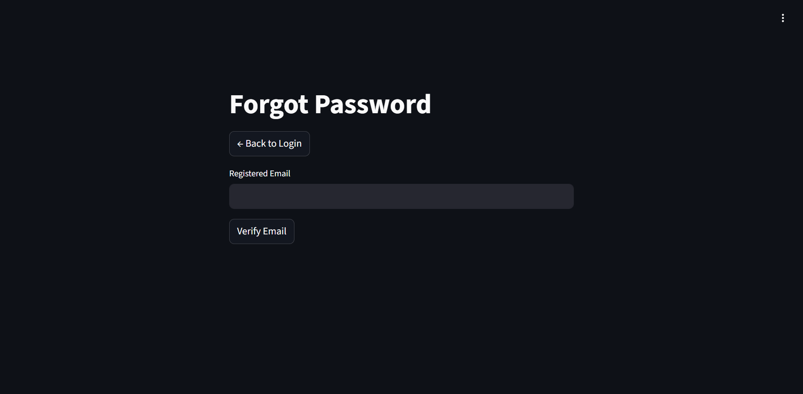

# Milestone 1 – User Authentication System

## Project Title
TextMorph – Advanced Text Summarization and Paraphrasing

## Description
In Milestone 1, we developed a secure and functional User Authentication System using Streamlit, JWT, MongoDB Atlas, and Ngrok.

This authentication system serves as the foundation for the TextMorph project. It includes secure user signup, login authentication using JWT tokens, a protected dashboard page, and a complete forgot password flow using security questions.

User credentials are securely stored in MongoDB Atlas database.

---

## Technologies Used
- Streamlit (Frontend UI)
- JWT – JSON Web Token (Authentication & Session Management)
- MongoDB Atlas (Cloud Database) – https://www.mongodb.com/atlas
- Ngrok (Public URL for local app) – https://ngrok.com/
- Python

---

## Features Implemented
- User Signup with validation
- Secure Login using JWT
- Protected Dashboard after login
- Security question & answer for password recovery
- MongoDB Atlas database integration
- Ngrok public URL integration

---

## How to Run the Application

1. Install required dependencies:
2. Create a MongoDB Atlas account:
   https://www.mongodb.com/atlas

   Create a cluster and copy your connection string.
   Replace the MongoDB connection string in the code with your own.
4. Create an Ngrok account:
   https://ngrok.com/

   Get your authentication token and add it inside the code.
5. Run the application
6. Run the application

---

## Screenshorts

### Signup Page

### Login Page

### Dashboard

### Forgot Password Page

